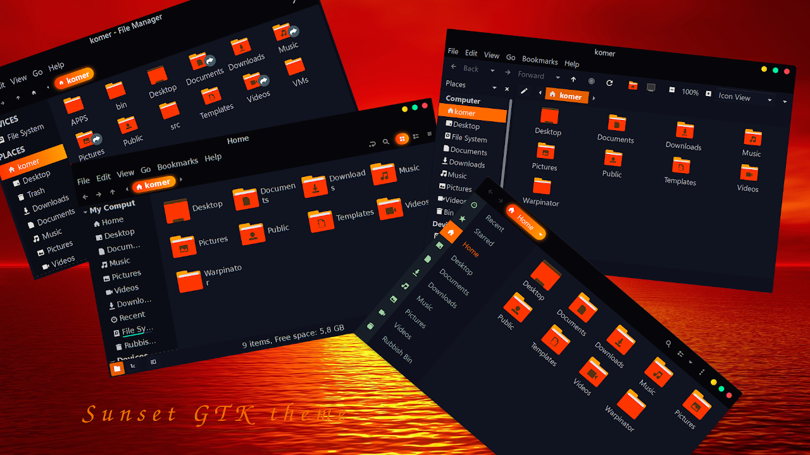

# Sunset GTK theme

Sunset is a dark orange-accented Gtk3.20+ theme based on [Sweet theme](https://github.com/EliverLara/Sweet) by EliverLara and [Mint-Y-Dark](https://github.com/linuxmint/mint-themes) by Linux Mint development team. It is mostly created for my personal use but also shared for anyone that might like it.

#### Installation:

Extract the zip file to the themes directory i.e. `/usr/share/themes/` for system-wide use; or to `~/.themes/` (create it if necessary) for single user. Then change theme via distribution specific tool.

